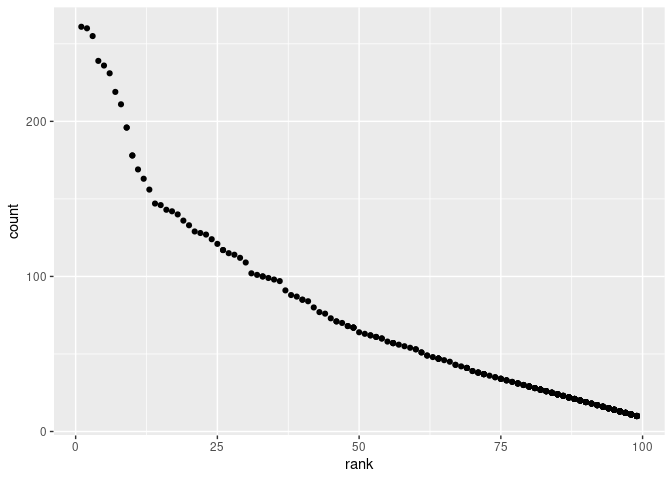

P8105\_hw2\_tg2753
================

``` r
library(tidyverse)
library(readxl)
```

## Problem 1

Read and clean the Mr. Trash Wheel sheet:  
-specify the sheet in the Excel file and to omit non-data entries (rows
with notes / figures; columns containing notes) using arguments in
read\_excel -use reasonable variable names  
-omit rows that do not include dumpster-specific data  
-round the number of sports balls to the nearest integer

``` r
trashwheel_df = 
    read_excel("./Dataset/Trash-Wheel-Collection-Totals-7-2020-2.xlsx",
        sheet = "Mr. Trash Wheel",
        range = cell_cols("A:N")) %>% 
    janitor::clean_names() %>% 
    drop_na(dumpster) %>% 
    mutate(sports_balls = round(sports_balls))
```

Read and clean precipitation data for 2018 and 2019. For each, omit rows
without precipitation data and add a variable for year. Next, combine
precipitation datasets and convert month to a character variable.

``` r
precipitation_df_2018 = 
    read_excel("./Dataset/Trash-Wheel-Collection-Totals-7-2020-2.xlsx",
        sheet = "2018 Precipitation",
        skip = 1) %>% 
    janitor::clean_names() %>% 
    drop_na(month) %>% 
    mutate(year = 2018, month = month.name) 

precipitation_df_2019 = 
    read_excel("./Dataset/Trash-Wheel-Collection-Totals-7-2020-2.xlsx",
        sheet = "2019 Precipitation",
        skip = 1) %>% 
    janitor::clean_names() %>% 
    drop_na(month) %>% 
    mutate(year = 2019, month = month.name)

precipitation_df = left_join(precipitation_df_2018, precipitation_df_2019,
                             by = "month")
```

trashwheel\_df has 454 observations while the precipitation\_df has 12
observations.  
the total precipitation in 2018 is 70.33  
the median number of sports balls in a dumpster in 2019 is 9

## Problem 2

First, clean the data in pols-month.csv. Use separate() to break up the
variable mon into integer variables year, month, and day; replace month
number with month name; create a president variable taking values gop
and dem, and remove prez\_dem and prez\_gop; and remove the day
variable.

``` r
pols = read_csv("./Dataset/pols-month.csv") %>% 
    separate(col = mon, into = c("year", "month", "day")) %>% 
    mutate(year = as.character(year),
           month = as.integer(month),
           month = month.name[month],
           president = ifelse(prez_dem=="1","dem","gop")) %>% 
    select(-prez_dem, -prez_gop, -day) 
```

Second, clean the data in snp.csv using a similar process to the above.
For consistency across datasets, arrange according to year and month,
and organize so that year and month are the leading columns.

``` r
snp = read_csv("./Dataset/snp.csv") %>% 
    mutate(date = lubridate::mdy(date)) %>%
    separate(col = date, into = c("year", "month", "day")) %>% 
    mutate(year = as.numeric(year),
           year = ifelse(year > 2021, year - 100, year)) %>% 
    arrange(year,month) %>%
    mutate(year = as.character(year),
           month = as.integer(month),
           month = month.name[month]) %>%
    select(-day)
```

Third, tidy the unemployment data so that it can be merged with the
previous datasets. This process will involve switching from “wide” to
“long” format; ensuring that key variables have the same name; and
ensuring that key variables take the same values.

``` r
unemployment = read_csv("./Dataset/unemployment.csv") %>% 
     pivot_longer(Jan:Dec,
                 names_to = "month",
                 values_to = "unemployment_percentage") %>%
    mutate(Year = as.character(Year),
           month = match(month,month.abb),
           month = month.name[month]) %>%
    rename(year = Year) %>%
    relocate(year, month) %>% 
    arrange(year,month)
```

Join the datasets by merging snp into pols, and merging unemployment
into the result.

``` r
result = left_join(left_join(pols,snp),unemployment)
```

| year | month    | gov\_gop | sen\_gop | rep\_gop | gov\_dem | sen\_dem | rep\_dem | president | close | unemployment\_percentage |
|:-----|:---------|---------:|---------:|---------:|---------:|---------:|---------:|:----------|------:|-------------------------:|
| 1947 | January  |       23 |       51 |      253 |       23 |       45 |      198 | dem       |    NA |                       NA |
| 1947 | February |       23 |       51 |      253 |       23 |       45 |      198 | dem       |    NA |                       NA |
| 1947 | March    |       23 |       51 |      253 |       23 |       45 |      198 | dem       |    NA |                       NA |
| 1947 | April    |       23 |       51 |      253 |       23 |       45 |      198 | dem       |    NA |                       NA |
| 1947 | May      |       23 |       51 |      253 |       23 |       45 |      198 | dem       |    NA |                       NA |
| 1947 | June     |       23 |       51 |      253 |       23 |       45 |      198 | dem       |    NA |                       NA |

| year | month    | gov\_gop | sen\_gop | rep\_gop | gov\_dem | sen\_dem | rep\_dem | president |   close | unemployment\_percentage |
|:-----|:---------|---------:|---------:|---------:|---------:|---------:|---------:|:----------|--------:|-------------------------:|
| 2015 | January  |       31 |       54 |      245 |       18 |       44 |      188 | dem       | 1994.99 |                      5.7 |
| 2015 | February |       31 |       54 |      245 |       18 |       44 |      188 | dem       | 2104.50 |                      5.5 |
| 2015 | March    |       31 |       54 |      245 |       18 |       44 |      188 | dem       | 2067.89 |                      5.5 |
| 2015 | April    |       31 |       54 |      244 |       18 |       44 |      188 | dem       | 2085.51 |                      5.4 |
| 2015 | May      |       31 |       54 |      245 |       18 |       44 |      188 | dem       | 2107.39 |                      5.5 |
| 2015 | June     |       31 |       54 |      246 |       18 |       44 |      188 | dem       | 2063.11 |                      5.3 |

**pols** has 822 observations. It shows the number of national
politicians who are democratic or republican at any given time. Then
range of years is 1947 - 2015. The key variables : gov\_gop, sen\_gop,
rep\_gop, gov\_dem, sen\_dem, rep\_dem, president.

**snp** has 787 observations. It shows the closing values of the S&P
stock (Standard & Poor’s) index, which is often used as a representative
measure of stock market as a whole. Then range of years is 1950 - 2015.
The key variables are: close.

**unemployment** 816 observations. It shows the percentage of
unemployment on the associated date. Then range of years is 1948 - 2015.
The key variables are unemployment\_percentage.

**result**, has 822 observations. The range of years is 1947 - 2015. The
key variables are: gov\_gop, sen\_gop, rep\_gop, gov\_dem, sen\_dem,
rep\_dem, president, close, unemployment\_percentage.

## Problem 3

Load and tidy the data

``` r
baby_name = read_csv("./Dataset/Popular_Baby_Names.csv")%>% 
    janitor::clean_names() %>%
    distinct() %>%
    mutate(
        ethnicity = recode(ethnicity,
                       "ASIAN AND PACI" = "ASIAN AND PACIFIC ISLANDER",
                       "BLACK NON HISP" = "BLACK NON HISPANIC", 
                       "WHITE NON HISP" = "WHITE NON HISPANIC"),
        childs_first_name = str_to_title(childs_first_name)
    )
```

    ## Rows: 19418 Columns: 6

    ## ── Column specification ────────────────────────────────────────────────────────
    ## Delimiter: ","
    ## chr (3): Gender, Ethnicity, Child's First Name
    ## dbl (3): Year of Birth, Count, Rank

    ## 
    ## ℹ Use `spec()` to retrieve the full column specification for this data.
    ## ℹ Specify the column types or set `show_col_types = FALSE` to quiet this message.

Produce a well-structured, reader-friendly table showing the rank in
popularity of the name “Olivia” as a female baby name over time; this
should have rows for ethnicities and columns for year. Produce a similar
table showing the most popular name among male children over time.

``` r
olivia = filter(
    baby_name, childs_first_name == "Olivia" & gender == "FEMALE") %>%
    select(year_of_birth, ethnicity, rank) %>%
    pivot_wider(names_from = "year_of_birth",values_from = "rank")
```

| ethnicity                  | 2016 | 2015 | 2014 | 2013 | 2012 | 2011 |
|:---------------------------|-----:|-----:|-----:|-----:|-----:|-----:|
| ASIAN AND PACIFIC ISLANDER |    1 |    1 |    1 |    3 |    3 |    4 |
| BLACK NON HISPANIC         |    8 |    4 |    8 |    6 |    8 |   10 |
| HISPANIC                   |   13 |   16 |   16 |   22 |   22 |   18 |
| WHITE NON HISPANIC         |    1 |    1 |    1 |    1 |    4 |    2 |

``` r
top_male_name = filter(baby_name, gender == "MALE" & rank == 1) %>%
    select(year_of_birth, ethnicity, childs_first_name) %>% 
    pivot_wider(names_from = "year_of_birth",
                values_from ="childs_first_name")
```

| ethnicity                  | 2016   | 2015   | 2014   | 2013   | 2012   | 2011    |
|:---------------------------|:-------|:-------|:-------|:-------|:-------|:--------|
| ASIAN AND PACIFIC ISLANDER | Ethan  | Jayden | Jayden | Jayden | Ryan   | Ethan   |
| BLACK NON HISPANIC         | Noah   | Noah   | Ethan  | Ethan  | Jayden | Jayden  |
| HISPANIC                   | Liam   | Liam   | Liam   | Jayden | Jayden | Jayden  |
| WHITE NON HISPANIC         | Joseph | David  | Joseph | David  | Joseph | Michael |

for male, white non-hispanic children born in 2016, produce a scatter
plot showing the number of children with a name (y axis) against the
rank in popularity of that name (x axis).

``` r
plot_df = filter(baby_name, 
                 gender == "MALE", 
                 ethnicity == "WHITE NON HISPANIC",
                 year_of_birth == 2016)
ggplot(plot_df, aes(x = rank, y = count)) + geom_point()
```

<!-- -->
